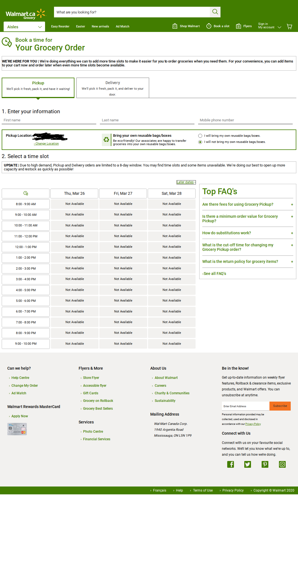

# Walmart-Canada-Pickup_Monitor
This is a little script that I developed last year on my raspberry pi zero to figure out what is the best time to order my groceries in Walmart.

During our first lockdown due to covid, I have tried many times to order groceries at my local Walmart with no luck as all pickup spots were always taken. Fustrated, I developed a script running selenium with headless browser to take the screenshot of the pickup spots availability in which all I need to set is the interval that I want to take a screenshot of all the time slots and how many times that I want to run it. This is designed to go through all of the pages of the time slots and the screenshotes are renamed to display at which day, month and time of which the screenshots are taken.

I ran it for a few days on my PI zero powered by a battery bank and I have found the pattern of people in terms of when they started reserving spots in my local Walmart and have found the best optimal time for me to order mine as well.

